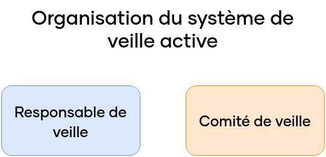

\newpage

#   Système de veille active

En plus de l'expression du besoin de la modernisation du SI de Breizhsport, la direction a constaté que les pratiques de développement de l'entreprise sont vieillissantes et souhaite également les moderniser. Étant à la tête de l'équipe de développeurs, il est nécessaire de mettre en place un système permettant la montée puis le maintien en compétences des parties prenantes concernant le développement et la mise en production des éléments du SI.

##  Définition du système de veille

Un système de veille peut être vu comme un ensemble d'éléments qui permettent le suivi des actualités afin de rester au courant des bonnes pratiques, d'outils, de failles de sécurité, etc. On peut également définir la veille active, qui est la surveillance de l'environnement d'une entreprise. On peut par exemple avoir une veille stratégique pour déterminer les modes de consommation, une veille concurrentielle, sectorielle et commerciale afin de surveiller ses concurrents, leurs stratégies marketing et commerciales, etc.
Nous cherchons donc à mettre en place un système de veille informatique au sens large, afin de nous tenir au courant des bonnes pratiques et outils permettant de gagner en qualité, réduire les coûts ou combler les failles de sécurité, ceci dans le but d'éviter une nouvelle refonte dans quelques années.

##  Système de veille active

Pour mettre en place un système de veille active, il faut que celui-ci soit bien défini au préalable, avec des objectifs, des rôles et des méthodes de fonctionnement clairs.  

### Objectifs

Dans un premier temps, il convient de définir les objectifs de celui-ci dans le cadre de la modernisation du SI de Breizhsport :

 -  Améliorer la qualité des produits et services développés;
 -  Actualiser les compétences des membres de l'équipe sur les dernières tendances et innovations;
 -  Réduire les risques de dysfonctionnement lors de la mise en production;
 -  Pouvoir réagir rapidement en cas de faille de sécurité découverte sur un ou plusieurs outils.

\newpage

### Organisation

Dans un deuxième temps, on souhaite organiser notre système de veille de la façon suivante :

{width=40%}

 -  Un responsable de la veille active, qui sera chargé de la coordination du processus. Il sera responsable de la définition des thèmes de veille, de la collecte des informations, de leur traitement et de leur diffusion;
 -  Un comité de veille qui sera constitué de membres de l'équipe. Il sera consulté par le responsable de la veille pour la définition des thèmes de veille et pour la validation des informations collectées.

Ce système à deux acteurs permet une définition claire des rôles tout en impliquant le plus d'individus possible, ce qui contribue au partage de connaissances. Dans notre cas, le "tech leader" est le responsable de la veille active, tandis que le comité de veille est constitué des cinq développeurs de notre équipe.

### Méthodes de collecte d'informations

Dans un troisième temps, nous allons nous intéresser aux méthodes pour collecter des informations depuis certaines sources.
Parmi les sources qui peuvent nous intéresser, nous retrouvons :

 -  Les publications scientifiques, comme les revues spécialisées : *IEEE Software*, *ACM Transactions on Software Engineering and Methodology*, *Journal of Systems and Software*.
 -  Les conférences et événements professionnels : *Microsoft*, *Google*, *IBM*, *ACM SIGSOFT Conference on Software Engineering*, *IEEE International Conference on Software Engineering*, *European Conference on Software Engineering*.
 -  Les blogs et sites web spécialisés : *Medium*, *Wired.com*, *Google Feed*, *StackExchange*.
 -  Les réseaux sociaux : *LinkedIn*, *Quora*.

\newpage

En variant les sources, nous pouvons faire varier les informations et la façon dont elles sont apportées. Pour pouvoir les collecter, il existe différentes méthodes plus ou moins automatisées, comme la connexion à des flux RSS [^4] ou Atom, ou encore l'utilisation d'application dédiée comme *Feedly*. Il est également intéressant, selon notre point de vue, d'organiser une réunion bimensuelle afin de pouvoir discuter librement de sujets afin de les partager à l'ensemble de l'équipe. Enfin, on peut proposer des webinaires et conférences proposés par des entreprises externes aux membres de l'équipe pour qu'ils collectent des informations et les fassent remonter au responsable de veille. Un tableau récapitulatif des sources est disponible plus bas.

### Traitement des informations

Les informations collectées sont à traiter par le responsable de la veille. Son but est alors d'analyser les informations pertinentes et utiles, de les synthétiser, et de les rendre accessibles aux membres de l'équipe au travers d'une plateforme de diffusion que l'on verra par la suite. On souhaite que les informations, après traitement, soient conformes à la Réglementation Générale sur la Protection des Données (RGPD), ainsi qu'elles restent sourcées.

### Diffusion des informations

Enfin, la dernière étape pour les informations est de les partager à l'ensemble des membres de l'équipe. Le format et la fréquence de partage peuvent varier, comme son accès. Il peut soit être sur la base du volontariat en utilisant un système de tableau de bord pour retrouver des informations, ou bien plus poussé en leur envoyant une newsletter et les faisant participer à des réunions de partage évoquées précédemment. Le format idéal, selon nous, est de fournir un résumé des informations à l'ensemble des collaborateurs, et centraliser des informations pour ceux qui souhaiteraient en savoir plus.

##  Utilisation

Le système que l'on vient de décrire permet de collecter des informations de la part de plusieurs utilisateurs, qui seront à l'origine de décisions lors de la vie du projet, ainsi que lors de son maintien une fois la modernisation accomplie. Cependant, celui-ci est amené à évoluer, tant en termes de sources de veille, que de mode de fonctionnement, que de partage de l'information.  
Celui-ci peut être adapté afin de cibler des thèmes de veille plus spécifiques en fonction des besoins, ou des modes de communication qui seraient mieux intégrés dans le fonctionnement des équipes.

\newpage

##  Liste des principales sources d'informations

Voici une liste non exhaustive de sources sur lesquelles on souhaite s'appuyer afin d'organiser la veille active. Cette liste sera amenée à évoluer dans le temps en fonction des besoins et des retours d'expérience.

{width=48%}

[^4]: RSS - Really Simple Syndication