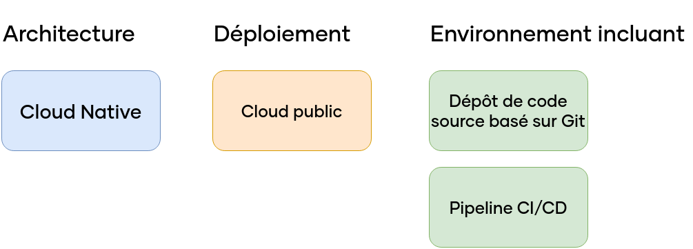
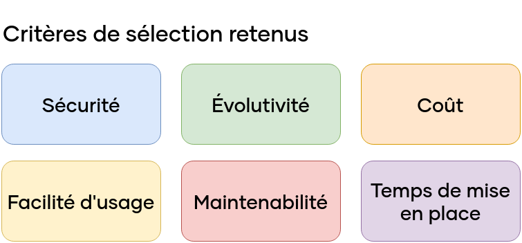

\newpage

#   Architecture proposée

Comme vu précédemment lors de l'introduction, la direction souhaitant se lancer sur le créneau de la vente en ligne, nous a demandé de mettre en place une plateforme de e-commerce. Cette application est faite et maintenue par les développeurs en interne de l'entreprise. Au cours des pages précédentes, nous verrons les critères nous permettant de choisir une solution pour répondre à ce besoin, puis nous verrons comment nous allons mener le projet avec le choix d'une méthode de travail, ainsi que l'architecture et l'hebergement de cette application.

##   Benchmark de l'architecture

Toujours dans le cadre de la modernisation du SI de Breizhsport qui nous a été confié, la direction nous a demandé de baser le développement de l'application de vente en ligne sur des technologies modernes. Ainsi, elle souhaite que l'on oriente celle-ci sur les piliers suivants :

{width=60%}

###  Choix de l'architecture

L'architecture d'une application représente la façon dont celle-ci est construite, est organisée, la façon dont elle fonctionne. Bien que chaque application soit unique, cela permet nos choix en terme de maintenance, complexité, de sécurité ou de redondance, chaque architecture ayant ses avantages et ses défauts.

Les différents critères que nous avons retenus sont les suivants. Ceux-ci sont liés à la fois au cycle de développement et au cycle de maintenabilité au cours de la vie de l'application.

-   **Complexité** : L'architecture est peu complexe et permet une organisation assez simple ?
-   **Flexibilité** : L'architecture est aisément adaptable à de nouveaux besoins ?
-   **Maintenabilité** : L'architecture permet une maintenance aisée de l'application ?
-   **Adaptée à de gros projets (AGP)** : L'architecture facilite le développement d'application complexe ?

Concernant les différentes architectures, nous allons en comparer quatre :

 -  **Monolithique** : Toutes les fonctionnalités de l'application sont regroupées dans un seul même bloc.
 -  **Microservices** : Les fonctionnalités sont découpées en petits blocs indépendants et capable de communiquer entre eux.
 -  **Headless** : La partie "front-end" (visible des utilisateurs) est séparée de la partie "back-end" (traitement et stockage de données).
 -  **Modèle-vue-contrôleur (MVC)** : Les données, la présentation et la logique métier sont séparées.

####    Architecture monolithique

L'architecture monolithique est l'architecture la plus simple, toutes les fonctionnalités sont regroupées ensemble. Cette solution présente l'avantage d'être simple à développer et à maintenir, mais au prix d'une faible flexibilité où il est compliqué de la faire évoluer en cas d'évolution du besoin.

####    Architecture en microservices

L'architecture en microservices est un peu l'opposé de l'architecture monolithique, toutes les fonctionnalités sont organisées en blocs indépendants entre eux, parfois même programmés avec des technologies différentes. Bien qu'une telle architecture complexifie le développement et la maintenance de l'application, on gagne en flexibilité et capacité d'évolution. Il est très aisé de rajouter un bloc de fonctionnalités correspondant à un nouveau besoin, puisque les blocs sont indépendants et ne font que communiquer entre-eux.

####    Architecture headless

Ce format d'architecture est un peu moins courant que les deux précédentes. On peut la voir comme un mélange entre les deux précédents : toutes les fonctionnalités liées au stockage et le traitement des données (back-end) va être regroupée dans un bloc commun, mais les interfaces utilisateurs vont être indépendantes et communiquer avec le back-end au travers d'une API [^7]. Ce format permet une grande flexibilité, car le font-end et le back-end sont isolés, mais présente l'inconvenient d'être assez complexe, surtout si l'on dispose de plusieurs interfaces utilisateurs.

####    Modèle-vue-contrôleur (MVC)

Comme son nom l'indique, l'architecture modèle-vue-contrôleur sépare les données, de l'interface, et de la logique métier. Ces modules séparés facilitent le développement et la maintenance. Il faut toutefois garder en tête qu'un tel modèle ne favorise pas la flexibilité de l'application en cas de nouveaux besoins. Néanmoins, cela reste un modèle couramment utilisé pour les applications web et mobiles.

\newpage

###    Grille de choix

Maintenant que nous avons différents critères et solutions, nous pouvons les évaluer dans le tableau ci-dessous. La notation est sur une échelle de 1 à 4, 1 étant un "non", 4 étant un "oui" aux questions définies pour les critères.

| Critère / Architecture... | Monolithique | Microservices | Headless | MVC    |
|---------------------------|-------------:|--------------:|---------:|-------:|
| Complexité                |            4 |             2 |        2 |      2 |
| Flexibilité               |            1 |             3 |        3 |      2 |
| Maintenabilité            |            2 |             3 |        3 |      3 |
| AGP                       |            1 |             4 |        3 |      3 |
| **Total**                 |        **8** |        **12** |   **11** | **10** |
Table: Grille de choix de l'architecture de l'application.

Cette grille de choix nous permet de déterminer qu'une architecture en microservices est la plus adaptée en fonction de nos critères et de notre contexte de projet. De plus, ce choix d'architecture s'associe bien avec le mode d'hébergement choisi que nous verrons par la suite. Cependant, comme nous le verrons par la suite nous allons privilégier l'utilisation d'un CMS à une application en microservices, pour des questions de simplicité en lien avec le besoin de l'entreprise.

##  Recherche de solution

Pour créer un site internet avec des fonctionnalités de vente en ligne, il nous faut impérativement trouver une solution vers laquelle nous orienter. Les possibilités sont vastes, très vastes mêmes puisque l'on estime qu'il y aurait eu 207 000 sites de vente en ligne actifs à la fin de l'année 2022 en France.[^5]
Ainsi, comme nous l'avons vu auparavant, l'idéal serait de trouver une solution avec une architecture en microservices. Cependant, afin de trouver une solution qui soit adaptée au besoin et au contexte de Breizhsport, il nous faut mettre en place des critères à évaluer pour différentes solutions que l'on envisage, sans prendre en compte le choix de l'architecture vu précédemment.

Nous définissons les critères suivants :

{width=55%}

 -  **Sécurité** : Concerne le niveau de sécurité de la solution.
 -  **Évolutivité** : Est-ce que la solution peut évoluer aisément dans le temps pour obtenir de nouvelles fonctionnalités ?
 -  **Coût** : La solution est-elle peu onéreuse ?
 -  **Facilité d'usage** : La solution est-elle simple à mettre en place ? Ceci est lié aux compétences des développeurs qui aura été établi.
 -  **Maintenabilité** : Est-il facile de réaliser la maintenance de la solution ?
 -  **Temps de mise en place** : Dans le contexte de Breizhsport qui souhaite se lancer rapidement sur le marché du e-commerce, un POC de la solution est-il envisageable à court-terme ?

Ces critères nous permettent de considérer plusieurs points-clés assez facilement, nous permettant de nous guider dans notre prise de décision.  
Pour les solutions envisagées, nous en avons trois :

{width=50%}

\newpage

###  Application propriétaire

L'application propriétaire serait une solution faite en interne par notre équipe de développement en utilisant uniquement des bibliothèques externes pour la réaliser. Il y a plusieurs avantages à la choisir, la principale étant qu'on aurait une compréhension totale de son fonctionnement, et que l'on a le choix de son architecture, ce qui lui confère une grande évolutivité, maintenabilité, et facilité d'usage pour les développeurs. Cependant, cela se ferait au prix d'un temps de développement assez long, et coûterait bien plus cher que des solutions alternatives. En terme de sécurité, elle reste assez neutre puisque d'un côté on ne disposerait que des fonctionnalités dont on a besoin, ce qui permet de limiter les failles de sécurité potentielles, mais notre équipe ne diposant pas de membre dédié à la sécurité, il sera difficile de découvrir des failles et de les combler sans devoir faire appel à un prestataire externe.

### Wordpress et Woocommerce

Une des solutions clé-en-main que l'on aurait serait d'utiliser un CMS [^6] comme Wordpress afin de créer un site internet. À cela, on rajouterait une extension du nom de Woocommerce afin de pouvoir gérer une boutique en ligne. Cette combinaison offres plusieurs avantages, dans un premier temps Wordpress est la solution la plus utilisée au monde : selon W3Techs, Wordpress faisait tourner 42% de tous les sites web sur internet en 2022. Étant un outil open-source et maintenu par une communauté assez active, il peut être considéré comme assez bien sécurisé. Il dispose d'un magasin d'extensions afin de pouvoir l'adapter pour faire ce dont on a besoin, comme par exemple une boutique e-commerce. Gratuit, il est également très simple d'utilisation avec une documentation fournie. Enfin, il peut rapidement être mis en place afin de répondre à un besoin court. Le principal désavantage qu'on pourrait lui trouver est qu'il embarque plus de fonctionnalités qu'on aurait besoin, ce qui complexifie sa compréhension par les équipes dans le cas où il y aurait un problème avec celui-ci.

### Shopify

Comme Wordpress, Shopify est un service en ligne qui permet de créer une boutique en ligne sans avoir à taper une seule ligne de code. Étant un outil dédié au e-commerce, il dispose d'une bonne documentation, un bon support, et une bonne sécurité face aux menaces. Il est également très rapide de créer sa boutique en ligne avec celui-ci, qui s'occupe de tout. L'idée est de fournir une solution tout en un que des non-informaticiens peuvent utiliser pour ouvrir une boutique en ligne. Cependant, il vient avec quelques inconvénients, pour commencer il s'avère assez onéreux tant en terme de coûts que de commission sur les transactions. De plus, il est difficile de le faire évoluer à l'avenir pour faire autre-chose que du e-commerce, ce qui peut être bloquant en cas d'un besoin changeant.

### Matrice de choix

À partir des éléments, il nous est possible de comparer ces solutions en utilisant une matrice de choix. La notation est 1-4, 1 étant défavorable, 4 étant favorable.

| Critère / solution | Solution propriétaire | Wordpress + Woocommerce | Shopify |
|---|--:|--:|--:|
| Sécurité | 3 | 4 | 4 |
| Évolutivité | 4 | 4 | 2 |
| Coût | 1 | 4 | 2 |
| Facilité d'usage | 2 | 3 | 4 |
| Maintenabilité | 4 | 2 | 2 |
| Temps de mise en place | 1 | 3 | 4 |
| **Total** | 15 | 20 | 18 |

On peut ainsi déterminer que la solution la plus adaptée à notre besoin est Wordpress et l'extension *WooCommerce*, sur les différents critères évoqués précédemment. Ce CMS dispose de sa propre architecture qui n'est pas celle que l'on a estimée auparavant. Cependant, nous estimons que sa complexité, son support et le fait que ce soit une solution mature prime sur une solution propriétaire basée sur une architecture en microservices, qui peut s'avérer être une tâche complexe étant donné le nombre de membres de l'équipe.

Par la suite, nous allons faire un comparatif des solutions pour pouvoir l'héberger, et le déployer pour répondre à notre besoin de modernisation du SI.

\newpage

##  Choix du mode d'hébergement

Outre le développement de l'application en elle-même, il est également important de déterminer le moyen de distribution auprès des utilisateurs finaux (les clients) le plus adapté à notre besoin, en se basant sur certains critères.  
La direction nous demande d'envisager une solution cloud, qui présente de nombreux avantages comme une très bonne flexibilité, une grande évolutivitée et une sécurité renforcée.  

Ainsi, nous allons définir les critères suivants pour orienter notre choix :

 -  **Sécurité** : La solution propose-t-elle des outils pour se protéger des attaques extérieures ?
 -  **Flexibilité** : La solution peut-elle évoluer facilement face à de nouveaux besoins ?
 -  **Coûts** : La solution est-elle peu onéreuse, tout service compris ?

Il existe trois méthodes principales pour héberger une application web afin de la distribuer en ligne :

 -  **Hébergement sur site (on-premise)**
 -  **Hébergement mutualisé**
 -  **Hébergement cloud**

Par la suite, nous allons évaluer ces solutions sur les critères précédémment choisis afin d'orienter notre choix.

####  Hébergement sur site (on-premise)

Comme son nom l'indique, l'hébergement sur site consiste à disposer de sa propre infrastructure dans les locaux de l'entreprise afin de distribuer des solutions. Cette solution est la plus flexible, dans le sens où l'on fait ce que l'on veut dessus et elle ne présente pas de problèmes quant à la confidentialité des données que l'on pourrait avoir avec un hébergeur public. Cependant, cela signifie également que l'on ne dispose d'aucun support, et si l'on ne dispose pas d'équipe liée à la sécurité, elle peut présenter de grandes vulnérabilités. Également, le coût est plus cher à l'acquisition et nous faisons face à des frais de fonctionnement et de maintenance. En somme, cette solution est surtout adaptée pour les grandes qui disposent d'équipes dédiées, et dont l'aspect sécurité et confidentialité est plus important que le critère de coûts.

####  Hébergement mutualisé

Son nom étant encore une fois explicite, un hébergement mutualisé est un hébergement partagé entre plusieurs entreprises et clients. Le but est de réduire un maximum les coûts en optimisant les ressources disponibles, mais cela se fait au détriment de la flexibilité, des performances, et du contrôle de l'infrastructure. Cette solution est surtout adaptée à de petis projets qui ne nécessitent pas beaucoup de ressources.

####  Hébergement cloud

Aussi appelé "cloud computing", le but est d'utiliser des serveurs à distance pour distribuer une solution en stockant et traitant les données associées. La différence avec les deux solutions précédents étant que l'on ne dispose pas d'un serveur en particulier, mais d'un ensemble de serveurs. Le principal avantage étant que la solution peut s'adapter en temps réel à la demande, en étant disponible sur plusieurs serveurs à la fois afin de répartir la charge. Les coûts sont notamment dépendants du traffic, c'est-à-dire que plus il y aura de traffic, plus les coûts seront élevés. Cependant, cette solution reste moins cher qu'une solution sur site. Enfin, tous les principaux fournisseurs de services cloud (Google, Amazon, Microsoft, IBM, OVH, etc.) disposent d'équipes de support et de sécurité. Ainsi, on externalise ces activités pour se concentrer sur l'application en elle-même.

###  Grille de choix

Afin de visualiser et de comparer ces différentes solutions et critères, nous pouvons les mettre sous forme de tableau comme ci-dessous. La notation est sur une échelle de 1 à 4, 1 étant un "non", 4 étant un "oui" aux questions définies pour les critères.

| Critère / Hébergement... | Sur site  | Mutualisé | Cloud |
|--------------------------|----------:|----------:|------:|
| Sécurité                 |         4 |         2 |     3 |
| Flexibilité              |         2 |         1 |     4 |
| Coûts                    |         1 |         4 |     3 |
| **Total**                |     **7** |     **7** |**10** |
Table: Grille de choix de la solution d'hébergement.

Ainsi, à l'aide de ces trois critères de sécurité, flexibilité et coûts, nous envisageons d'orienter le choix de la solution d'hébergement vers un hébergement cloud. Cela correspond bien à la volonté de l'entreprise, tout en étant en adéquation avec notre contexte. Pour rappel, nous ne disposons pas d'équipe pouvant gérer un hébergement en interne, et nous souhaitons avoir de la flexibilité au niveau de notre hébergement.

Ces choix, celui de la solution et de la méthode d'hébergement, nous permettent de valider la demande de la direction d'envisager une infrastructure cloud avec des fonctionnalités cloud native. Pour valider ce fonctionnement, nous mettrons  en place dans un premier temps un POC [^8] afin de valider son fonctionnement et ses fonctionnalités pour ensuite proposer l'application de production.

\newpage

#   Organisation

Suite à ces différents choix techniques, il est nécessaire pour nous de déterminer dès à présent la démarche à adopter pour mener à bien notre projet. Ainsi, nous allons chercher à implémenter une nouvelle méthode de travail qui est plus adaptée à notre nouveau besoin.

##   Benchmark des méthodes de développement

À la demande de la direction, nous souhaitons moderniser la méthodologie de développement en passant d'une méthode de cycle en V, à une méthode plus adaptée à des besoins informatiques.  
Ainsi, nous allons établir un comparatif afin d'orienter et d'évaluer nos choix, pour qu'ils correspondent au mieux à notre besoin de modernisation du SI de Breizhsport.

###  Critères

Nous souhaitons évaluer différentes méthodes de travail sur des critères en adéquation avec l'environnement où elle sera utilisée : le développement informatique. Cet environnement est connu pour avoir des besoins et des priorités qui changent très rapidement, et auxquels il est nécessaire de devoir s'adapter afin de mener correctement le projet à terme.

Traditionnellement, on dispose de deux types de méthodes de travail : celles utilisant une approche dite prédictive, et celles utilisant une approche dite itérative. 

 -  Le premier est le plus simple, au début du projet on va lister et ordonner toutes les tâches du projet qui sont nécessaires pour mener le projet à terme. Cette approche est surtout utile lorsque le besoin ne risque pas d'évoluer et que l'on souhaite avoir une bonne estimation des coûts et du temps de travail comme ça pourrait être le cas dans le BTP par exemple.
 -  La seconde est dit itératif, car à chaque cycle, chaque itération de celui-ci, on va évaluer le besoin pour définir les priorités de travail. Les cycles et la liste des tâches sont définis au début du projet, mais ils peuvent évoluer au cours de la vie du projet.

Ainsi, chaque méthode de travail est basée sur une approche qui dispose d'avantages par rapport à l'autre. Les méthodes traditionnelles ou de cycle en V utilisent des approches prédictives, là où des méthodes comme le DevOps ou SCRUM sont itératives.  
Chaque projet étant unique tant concernant la taille, la complexité ou encore les contraintes de temps et de budget, il nous faut trouver celle qui est le plus adaptée à notre projet de modernisation du SI de Breizhsport.  

Afin d'appuyer nos propos, il nous faut nous baser sur des critères de comparaison. Dans notre cas, nous avons choisi les suivants :

 -  **Flexibilité** : La méthode permet-elle de s'adapter aux changements de besoins ou de priorités ?
 -  **Réactivité** : La méthode permet-elle de délivrer des livrables rapidement ?
 -  **Qualité** : La méthode permet-elle de produire des logiciels de qualité ?
 -  **Collaboration et communication** : La méthode favorise-t-elle la collaboration et la communication entre les différents membres de l'équipe ?

###  Comparaison

Nous allons comparer quatre méthodes de développement qui sont couramment utilisées : Cascade (aussi appelée traditionnelle ou waterfall), SCRUM, DevOps et Kanban.

#### Cascade

La méthode en Cascade est probablement la méthode prédictive la plus simple : Toutes les tâches sont définies en avance, elles se suivent dans un ordre séquentiel : chaque tâche doit être complétée avant de pouvoir passer à la suivante. Pour du développement informatique, on pourrait la décomposer en quatre phases : étude, conception, développement, tests et déploiement de la solution. 
L'avantage étant que cette méthode est simple à comprendre et à mettre en place. Cependant, elle s'avère inadaptée sur plusieurs points; elle est peu flexible dans le sens où il est difficile de s'adapter à un changement de besoin ou de priorité, ce qui est courant dans notre contexte. De plus, elle peut s'avérer longue et coûteuse, et est plutôt dimmensionnée pour des petits projets.

#### SCRUM

SCRUM est une méthode ayant une approche itérative qui comporte des cycles courts (appelés sprints) d'environ deux à quatre semaines. Un sprint est composé des phases suivantes : 

 -  **Sprint planning** (avant): Planification des tâches à effecter durant le sprint.
 -  **Daily** (pendant) : Réunion quotidienne pour suivre l'avancement du sprint.
 -  **Sprint Review** (après): Présentation du travail accompli durant le sprint.
 -  **Retrospective** (après): Réflexion sur le sprint dans une optique d'amélioration continue.

Cette méthode presente plusieurs avantages. Pour commencer, elle favorise le changement de besoins ou de priorités car elle se veut de nature flexible et réactive. De plus, elle favorise la collaboration et la communication entre les différents membres de l'équipe qui ont la liberté de s'auto-organiser pendant un sprint.  
Cependant, c'est une méthode assez différente de ce que les équipes peuvent connaître, et qui nécessite souvent une réorganisation des équipes pour pouvoir l'exploiter.

\newpage

#### DevOps

Le DevOps n'est pas à proprement parler une méthode de travail, mais plutôt un concept sur lequel les équipes peuvent se baser pour adapter leurs méthodes de développement. Le but est de rapprocher les équipes de développement et celles d'exploitation afin d'améliorer la collaboration et la communication entre ces deux équipes, pour réduire le temps de mise en production des logiciels.

Celle-ci favorise la collaboration et la communication entre les équipes de développement et d'exploitation, réduit le temps de mise en production, et améliore la qualité des logiciels. Cependant, comme SCRUM, elle peut être compliquée à mettre en place dans certaines entreprises car elle nécessite souvent une réorganisation des équipes.

#### Kanban

Kanban est une autre méthode de type itérative. Celle-ci est beaucoup lié au principe de lean management, qui vise à mieux gérer les flux de travail afin de favoriser la qualité tout en réduisant les déchets. 

Son principal avantage est d'être très visuelle. Au moyen d'un tableau, les tâches représentées sous la forme d'une carte sont disposées en colonnes en fonction des phases du projet. Ainsi, non seulement on gagne en flexibilité en pouvant s'adapter aux besoins et priorités, mais on gagne en communication entre les équipes puisque chacun connait l'état du projet. Cependant, ce mode de travail peut vite être surchargé pour les gros projets, et n'est pas toujours facile à mettre en place.

\newpage

###  Choix

À partir des éléments précédents, nous avons pu établir une matrice de choix basée sur les critères choisis précédemment. La notation se faisant de 1 à 4 afin d'éviter une note moyenne sans être trop simple ni trop complexe, avec 1 représentant un choix inadapté, et 4 un choix adapté.

| Critère/Méthode                | Cascade | SCRUM | DevOps | Kanban |
|--------------------------------|--------:|------:|-------:|-------:|
| Flexibilité                    |       1 |     4 |      3 |      3 |
| Réactivité                     |       1 |     4 |      4 |      3 |
| Qualité                        |       4 |     3 |      4 |      3 |
| Collaboration et communication |       1 |     4 |      3 |      2 |
| **Total**                      |   **7** |**15** | **14** | **11** |
Table: Matrice de choix de la méthode de travail

À partir de cette matrice, nous en concluant donc que la méthode la plus adaptée pour nos besoins de modernisation du SI de Breizhsport est la méthode SCRUM. Ce choix semble logique puisque la méthode SCRUM a été pensée pour des besoins de développement informatique contrairement à une méthode en Cascade. Néanmoins cela ne signifie pas que cette dernière est mauvaise, elle est juste inadaptée à nos besoins pour ce projet.

[^5]: [Étude réalisée par FEVAD (Fédération du e-commerce et de la vente à distance)](https://www.francenum.gouv.fr/magazine-du-numerique/e-commerce-en-france-chiffres-cles-et-5-tendances-fortes)
[^6]: CMS - Content Management System / Système de Gestion de Contenu
[^7]: API - Application Programming Interface - Boite à outils qui permet de communiquer depuis et vers un logiciel
[^8]: POC - Proof Of Concept