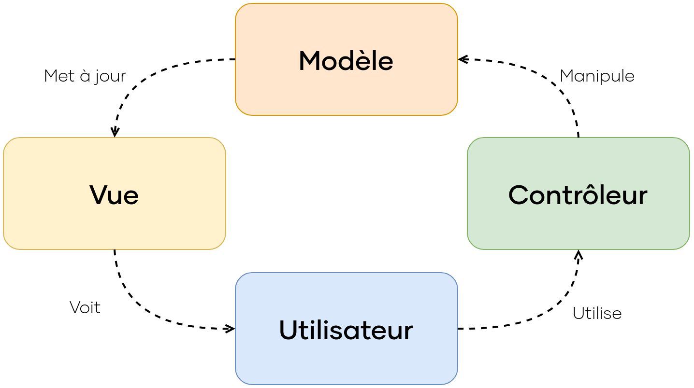
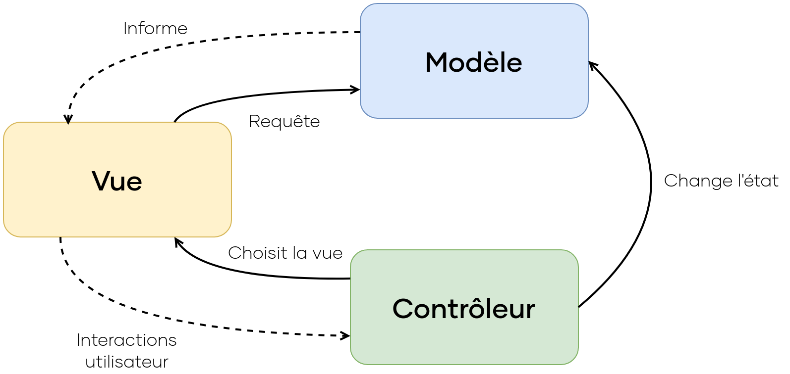
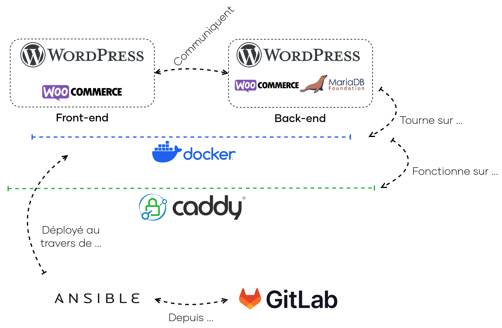
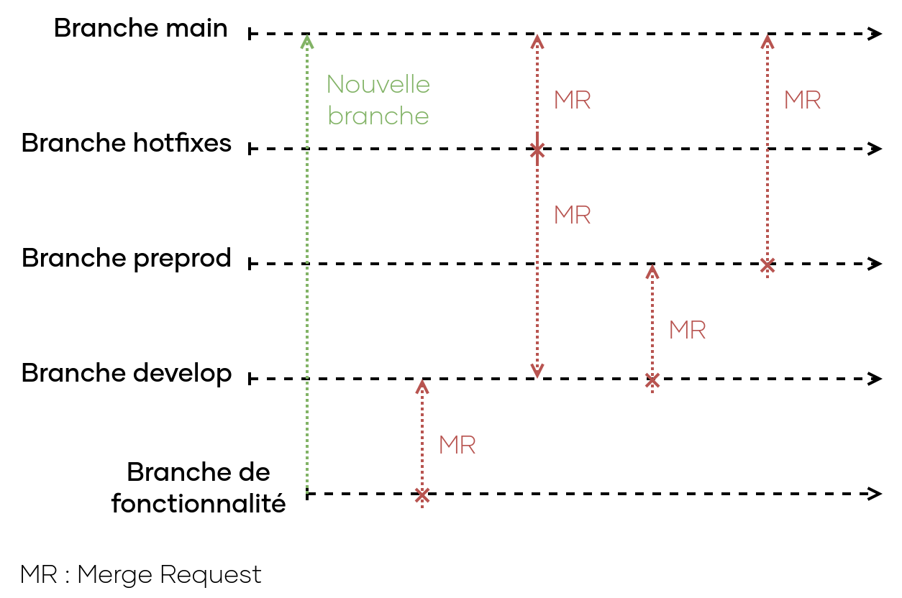

\newpage

#   Schéma d'architecture et de déploiement

Suite aux choix fonctionnels, nous souhaitons mettre en place un POC qui reprend les fonctionnalités principales de l'application, pour nous permettre d'à la fois valider les choix techniques, et de prendre des décisions afin de les adapter à notre besoin et au contexte de l'entreprise.  

Par la suite, nous verrons comment les choix techniques effectués précédémment ont été traduits afin de répondre au besoin de Breizhsport de développer une application de e-commerce permettant la vente en ligne.

##  Schéma d'architecture commenté

Comme vu précédémment, nous souhaitons mettre en place une solution Wordpress avec une extension Woocommerce pour répondre au besoin de la direction.  

Wordpress en lui-même a une architecture assez proche d'une architecture MVC vu précédemment, à quelques différences prêt.

{width=40%}

Tel que Wordpress a été fait, la "Vue" est au centre de l'application, où qui va pouvoir obtenir des données du "Modèle" et non l'inverse dans une architecture MVC. De plus, la "Vue" fourni une certaine logique métier au "Contrôleur", sans nécessairement passer par l'utilisateur.  
Pour vulgariser, on peut imaginer que Wordpress reçoive une URL. Un module de Wordpress, le "Core" agît en tant que contrôleur et détermine les requêtes initiales à exécuter sur la base de données, et par extension, la vue qui doit être chargée. Il met ensuite en forme la réponse à la requête initiale et l'envoie au fichier de la vue. Ce fichier de vue peut être un fichier strictement réservé à l'affichage, ou bien il peut demander des informations supplémentaires par rapport à celles qui sont intégrées. C'est le type "pull" du MVC, où la vue tire les données du modèle au lieu que le "contrôleur" "pousse" les données du modèle dans la vue.

{width=40%}

Ainsi, pour fonctionner, notre WordPress a besoin de plusieurs éléments :

-   Lui-même, à savoir ses fichiers "core", mais également un thème pour la vue et d'éventuelles extensions pour ajouter des fonctionnalités à notre application.
-   Woocommerce, qui est l'extension nous permettant de gérer notre boutique en ligne.
-   Une base de données, pour stocker et organiser toutes les informations nécessaires de notre application.
-   Un serveur web, lui permettant de s'éxécuter, de recevoir et d'émettre des requêtes. Ce serveur web certains prérequis, il lui faut notamment PHP[^9], langage dans lequel WordPress est en grande partie programmé.

Avec ces éléments, nous pouvons représenter notre application de la façon suivante :

{width=66%}

\newpage

Sur le schéma précédent, la même instance de WordPress et de Woocommerce sont bien à la fois côté "Front-end" et "Back-end". Voici les choix technologiques que nous avons fait en vue de mettre en place le POC : 

####    Base de données - MariaDB

**MariaDB** est un système de gestion de base de données open-source, qui est basé sur **MySQL**, un autre système de gestion de base de données. C'est une solution populaire qui outre le fait d'être assez performant et bien suivi, à plusieurs avantages; il dispose notamment d'outils contre des injections SQL ou par force brut, et se veut stable et fiable.

####    Serveur web - Caddy

Notre choix de serveur web s'est porté sur **Caddy**, pour plusieurs raisons. Bien que Apache et NGinx soient les plus répandus, Caddy présente plusieurs avantages assez intéressant pour nous. Dans un premier temps, celui-ci est simple à configurer, dans le sens où celui-ci utilisant un système de configuration déclaratif, il n'est pas aussi verbeux et chargé qu'Apache. Il utilise des techniques de mise en cache et d'optimisation pour à la fois réduire la charge du serveur, mais également améliorer les performances. Enfin, il est conçu pour être sécurisé en proposant un mode HTTPS par défaut, en plus d'autre outils d'authentification, d'autorisation, ou de chiffrement.

####    Docker

Afin de gérer plus efficacement la solution, nous avons choisis d'utiliser **Docker**, qui est un outil permettant d'empaqueter une application et ses dépendances dans un conteneur isolé, qui peut être exécuté sur n'importe quel serveur. L'objectif est d'isoler les services afin de le exécuter de façon indépendante, uniquement liés entre-eux par des réseaux virtuels. Dans notre cas, c'est particulièrement utile pour deux raisons. Dans un premier temps, on dispose d'images Docker prêtent à l'emploi, ce qui simplifie le travail d'intégration et de déploiement continu (CI/CD) que l'on verra par la suite. La seconde raison, est qu'il est plus facile de travailler avec plusieurs environnements différents. Dans notre cas, nous en avons un de développement, un de pré-production, et un de production.

####    Ansible

Toujours dans une optique de déploiement continu, nous avons choisis d'utiliser **Ansible**, qui nous permet d'automatiser le déploiement, la configuration et la gestion de notre infrastructure informatique. Il est surtout utile lorsque l'on dispose de plusieurs infrastructures différentes, comme c'est le cas pour nous avec la solution cloud. Encore une fois, il nous procure plusieurs avantages, notamment en terme de flexibilité où il est possible pour nous d'automatiser une grande variété de tâches, tout en nous laissant la possibilité de pouvoir le faire évoluer en cas de besoins changeants. De plus, il nous offre des fonctionnalités de sécurité nous permettant d'automatiser certaines tâches liées à sécuriser nos infrastructures.

####    GitLab

Enfin, **GitLab** est une forge basé sur *Git*, qui nous sert de dépôt de code-source distant. Son but est de rassembler les projets et les développeurs, pour qu'ils puissent travailler ensemble sur un ou plusieurs projets commun. Nous retrouvons ainsi un système de gestion des versions, de suivi de tâches et de bugs, un wiki, etc. La particularité de GitLab est de très bien intégrer des outils de CI/CD, ce qui nous facilite la tâche pour les créer et les gérer par la suite.

####    Fonctionnement

Nous pouvons résumer le fonctionnement du POC de la façon suivante : nous avons une seule et même instance WordPress, WooCommerce et MariaDB qui fonctionnent dans un conteneur Docker, lui même exécuté sur un serveur Caddy.  
Lorsque nous apportons des modifications sur l'environnement de développement, comme des nouvelles fonctionnalités, des pipelines de CI/CD sont exécutées et font des opérations de tests, de validation, de nettoyage, etc., dans le but de fournir un environnement standardisé et "propre" contenant ces nouvelles fonctionnalités.  

Une fois estimé que l'environnement de développement est assez stable et dispose des nouvelles fonctionnalités, on peut le basculer automatiquement sur l'environnement de pré-production en utilisant une nouvelle pipeline. Cette pipeline va exécuter de nouveaux tests avec cette fois-ci des données de production qui ont été anonymisées et traitées. Cet environnement nous permet d'avoir une bonne idée du fonctionnement de l'application, sans toutefois la rendre visible aux utilisateurs finaux.

Enfin, lorsque l'on estime que l'on peut peut publier l'application, on utilise une nouvelle pipeline qui va effectuer de nouvelles actions comme des tests de sécurité ou de performance avant de la publier.

Les déploiements entre environnements sont réalisés avec Ansible, qui automatise les tâches de configuration de nos infrastructures. Bien que similaires, il faut voir ces trois environnements comme distincts, en terme de fonctionnalités et de données.

\newpage

##  Schéma de déploiement commenté

Pour nous permettre d'intégrer de nouvelles fonctionnalités et de les déployer sans impacter les utilisateurs, nous nous devons d'avoir plusieurs environnements distincts, appelés "branches". Nous en avons quatre principales, plus une par fonctionnalité que nous souhaitons intégrer. Ainsi, imaginons que nous souhaitons développer puis intégrer une nouvelle fonctionnalité :

{width=66%}

Dans un premier temps, nous allons créer une nouvelle branche à partir de la branche principale de production, la branche "main". C'est sur cette branche que nous allons développer notre fonctionnalité, laissant les autres intactes.  
Une fois notre fonctionnalité prête, on peut demander à la fusionner avec la branche de développement, au travers d'un "Merge Request". Cette étape sert à résoudre les conflits, et s'assurer que l'on a pas de régression.  

Imaginons que l'on se rende compte d'un problème sur une fonctionnalité de production. Un correctif sera alors apporté depuis la branche "hotfixes" à la fois sur la branche "main", et aussi sur la branche "develop", encore une fois au travers d'une "Merge Request", qui va exécuter une pipeline comprenant des essais de non-régression, de qualité de code, etc.

Lorsque l'on estime qu'assez de fonctionnalités sont présentes sur la branche de développement, on exécute la pipeline permettant de la déplacer vers la branche de pré-production. Cette étape va tester notre fonctionnalité dans un environnement proche de celui de production, avec un jeu de données différent. 
Enfin, lorsque celle-ci est également suffisament stable, on exécute la pipeline permettant de la déplacer en production. Cette fois-ci, la fonctionnalité est confrontées à des données réelles et est visible des utilisateurs finaux.  

Si jamais on rencontre un problème avec la nouvelle fonctionnalité, et qui serait passée au travers des mailles du fillet des essais, il est toujours possible d'apporter un correctif en faisant une copie de la branche de production sur la branche "hotfixes", avant de la redéployer sur la branche de production.

<!--[Schema de principe de la chaîne d'intégration continue (CI)](ASSETS/IMAGES/III/CI.png)

-->

[^9]: PHP - PHP: Hypertext Preprocessor est un langage de script utilisé le plus souvent côté serveur.