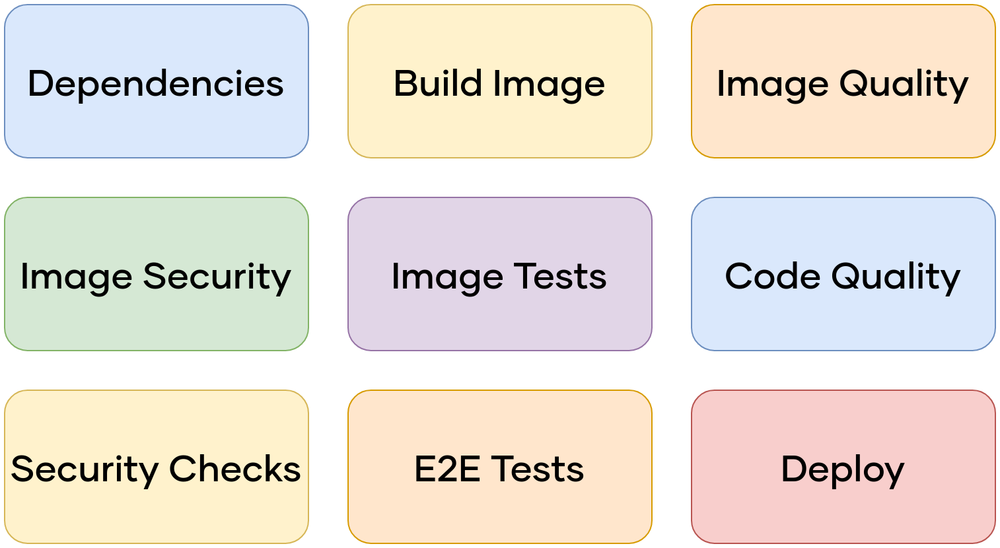

\newpage

#   Mise en place d'une chaine CI/CD

Comme nous l'avons abordé auparavant, suite à une demande de la direction, nous souhaitons passer d'un système de test, de validation et de déploiement manuel à un système d'intégration et de déploiement continue (CI/CD). Bien que similaires, les deux ont des objectifs différents que nous allons présenter par la suite.

##  CI - L'intégration continue

De l'anglais *Continuous Integration*, il faut le voir comme un ensemble de pratiques pour vérifier que les modifications de code source que l'on fait n'amène pas de régression dans l'application. Dans notre cas, nous allons ajouter une brique logicielle automatisant certaines tâches, comme de la compilation, des tests unitaires et fonctionnels, des tests de performance, etc. À chaque changement dans le code source, cette brique va s'exécuter et produire un ensemble de résultats. Cela nous permet de ne pas oublier d'éléments, de corriger d’éventuelles erreurs, et par conséquent améliorer la qualité du code tout en réduisant la dette technique.  

Pour pouvoir la mettre en place, il faut que notre code source soit partagé (sur GitLab dans notre cas), et que des tests d'intégration soient développés pour valider l'application. Il nous faut également un outil d'intégration continue, les plus connus étant *Jenkins*, *Travis CI*, *GitLab CI* et *CruiseControl*. Dans notre cas, nous avons utilisé GitLab CI pour son intégration avec la forge GitLab.

Le principe est le suivant :

{width=100%}

 -  **1a**/**1b** : Dans un premier temps, il nous faut récupérer les dépendances de nos outils (et les bonnes versions), comme *Composer* pour *PHP*. Cette étape est optimisée en détectant les changements sur les fichiers de configuration.
 -  **2** : Cette étape consiste à tester les *CVE*, les *Common Vulnerabilities and Exposures* sur notre code, mais aussi les dépendances. Il faut le voir comme des séries d'essais pour détecter si notre code est concerné par des failles connues de sécurité.
 -  **3** : Enfin, les dépendances sont mises à jour, ou supprimées, au besoin.

\newpage

 -  **3a**/**3b** : À cette étape, nous construisons les images *Docker* à partir des dépendances testées auparavant.
 -  **3c**/**4a**/**4b** : Une fois en possession de l'image, nous allons effectuer plusieurs essais dessus. Pour commencer, nous allons utiliser un *Linter*, un outil mettant en évidence les erreurs de syntaxe et de convention de code pour limiter les erreurs et la dette technique. Puis, le fonctionnement ainsi que les CVE de l'image sont testés.

Par la suite, nous avons un embranchement qui s'exécute en parallèle, un pour le *front-end*, l'autre pour le *back-end*.

 -  **5a-a** à **5c-b** : Ces étapes sont identiques, mais sur des données différentes. On souhaite à nouveau "linter" le code avec des technologies comme *ESLint* pour le *front-end*, et *PHP-cs-Fixer* pour le *back-end*. À la suite de ça, la complexité du code est analysée, ainsi que les *code-smells*, qui sont des erreurs liées à de mauvaises pratiques qui peuvent créer des défauts. Cela est fait dans un but de sécuriser l'application, et de prévenir la dette technique.
 -  **6a-a**/**6a-b** : À cette étape, nous pouvons effectuer des tests unitaires, c'est-à-dire tester des éléments en particulier de notre application. Ces tests nous permettent de valider le bon fonctionnement et prévenir d'éventuels problèmes.
 - **6b-a**/**6b-b** : Côté *back-end*, nous effectuons un *test de contrat d'API* pour vérifier que notre API répond bien à nos attentes, en utilisant un outil dédié comme *Newman*. Côté *front-end*, nous avons un test *End-To-End* (E2E), qui ressemble aux tests unitaires que nous avons effectués auparavant, mais cette fois-ci sur l'ensemble de l'application. Cela inclut des tests sur l'interface utilisateur (GUI), des tests d'intégration, de bases de données, de performance, etc. Plusieurs technologies existent pour cela, comme *Cypress* ou *Selenium*.
 -  **6c-a**/**6c-b** : Une fois tous les tests de fonctionnalité effectués et validés, nous pouvons effectuer un test de performance de l'application, en utilisant *K6* ou *Lighthouse*.
 -  **6d-b** : Uniquement sur la partie *front-end*, nous effectuons un test de régression visuelle avec *BackspotJS*, pour nous assurer que l'ajout ou la modification de fonctionnalité n'altère pas visuellement une autre fonctionnalité, et sous différents scénarii (pc, mobile, avec un lecteur d'écran, etc.).
 -  **7-a**/**7-b** : Une fois que toutes les étapes ont été validées, nous pouvons publier l'image qui a été générée auparavant. Avec cette étape, une nouvelle version est créée et incrémentée en fonction des changements. De plus, un changelog est produit afin de permettre à tout le monde de suivre les changements associés à cette version.  
 

\newpage

##  CD - Le déploiement continu

Toujours de l'anglais *Continuous Deployment*, est une pratique de développement logiciel dans laquelle le logiciel est généré de manière à pouvoir être mis en production à tout moment. On va différencier *Distribution Continue* de *Déploiement Continu*. Pour ce faire, un modèle de distribution continue implique des environnements de test similaires à ceux de la production. Les nouvelles générations réalisées dans le cadre d'une solution de distribution continue sont automatiquement déployées dans un environnement de test automatique d'assurance qualité qui recherche les erreurs et les incohérences. Une fois que le code a réussi tous les tests, la distribution continue nécessite une intervention humaine pour approuver le déploiement en production. Le déploiement lui-même est ensuite exécuté par l'automatisation.

Le déploiement continu fait aller un peu plus loin l'automatisation et supprime l'intervention manuelle. Les tests et les développeurs sont considérés comme suffisamment fiables pour qu'aucune approbation de la mise en production ne soit pas nécessaire. Si les tests aboutissent, le nouveau code est considéré comme approuvé, et le déploiement en production a lieu.

Le déploiement continu est le résultat naturel d'une distribution continue efficace. Finalement, l'approbation manuelle apporte peu ou pas de valeur et ne fait que ralentir les choses. À ce stade, elle est supprimée, et la distribution continue devient un déploiement continu.

Il existe plusieurs outils permettant de faire du déploiement continu, le plus populaire étant probablement **Kubernetes**. Ci-dessous, nous pouvons retrouver un schéma de principe d'un pipeline CD :

{width=100%}

Nous allons reprendre l'exemple d'une nouvelle fonctionnalité qui a été développée sur l'environnement de développement, et qui a été intégrée.

 -  **1** : de déploiement est réalisé automatiquement à l'aide d'*Ansible* sur l'environnement de test. Il est également possible d'utiliser *Autok8s* qui facilite et automatise l'utilisation de *Kubernetes*.
 -  **2** : de façon similaire, le déploiement est réalisé manuellement sur l'environnement de recette.
 -  **3** : une fois réalisé, le déploiement est automatiquement réalisé sur l'environnement de préproduction, toujours à l'aide d'*Ansible*.

\newpage

 -  **4** : il s'agit maintenant de récupérer les données de production en vue de tester la solution à déployer. Cependant, dans le respect du *RGPD*[^10], il est nécessaire de les anonymiser ou à minima de les pseudonymiser.
 -  **5a**/**5b**/**5c**/**5d** : à l'instar du pipeline *CI*, on souhaite procéder à des tests sur la solution à déployer, à commencer par des tests unitaires réalisés avec des outils comme *JEST* ou *Vitest*. Une fois les essais unitaires complétés, on effectue des essais sur l'ensemble de la solution (E2E) grâce à *Cypress*, avant de procéder à des tests de performance à l'aide de *K6* ou encore *Lighthouse*. Enfin, nous retrouvons quelques tests de non-régression visuelle, grâce à *BackspotJS*.
 -  **6** : ultime action sur l'environnement de préproduction, on effectue des essais de déploiement sur l'environnement de production, en vérifiant notamment les routes critiques de l'*API*.
 -  **7** : maintenant que notre solution a passé avec succès les essais de préproduction, il est temps de la déployer en production. Pour cela, soit on l'effectue automatiquement pour réduire le *time-to-market* et proposer les nouvelles fonctionnalités ou corrections au plus vite, soit on peut déployer manuellement, ce qui est pratique pour des raisons marketing. Par exemple, x fonctionnalité sera disponible à telle date.
 -  **8**/**9** : le déploiement complété, on réalise des essais de performance sur l'environnement de production, toujours avec *K6* ou *Lighthouse*. On en profite pour réaliser des tests suite au déploiement en vérifiant les routes et parcours critiques de la solution et de son *API*.
 -  **10** : cette étape est optionnelle et on souhaite l'éviter. Néanmoins, si l'on découvre des problèmes sur la solution suite à son déploiement en production, il faut pouvoir restaurer une version antérieure de la solution.

Ces étapes de chaine de déploiement continu permettent de fournir de façon automatisée et fréquente de nouvelles versions de la solution, tout en effectuant des essais pour perturber le moins possible la production, avec la possibilité de revenir en arrière si besoin.

\newpage

### Intégration sur le POC

Suite à la présentation de la chaine d'intégration continue et de déploiement continu, nous allons maintenant détailler la façon dont nous l'avons implémentée, en incluant le stack technique et justifiant son utilisation sur la façon dont il nous permet de répondre à notre besoin.

Pour les différentes étapes vues précédemment, voici les outils que nous allons utiliser :

La chaine d’intégration continue a été mise en place grâce au service **Gitlab-CI**, un service fourni par **Gitlab** open sourcé et gratuit. Afin de ne pas avoir de restriction de la part de **GitLab**, nous avons installé notre propre *runner* sur le serveur hébergeant notre site e-commerce afin de pouvoir lancer nos *pipelines*.  

Plusieurs jobs ont été mis en place pour couvrir l’ensemble des étapes pour le bon déroulement de cette chaine d’intégration continue :

{width=67%}

 -  Le premier job « dependencies » permet de mettre en place les différentes dépendances, ici **Composer**, qui va venir installer les différentes extensions dont nous avons besoin pour le projet.  
 -  Le second job « build image » permet de construire l’image de *Wordpress* ainsi que l’image de **Caddy** sur notre serveur web.  
 -  Le troisième job « image-quality » se traduit par la création d’une image de référence qui contient les configurations de base en référence à **Hadolint** un *linter* (outil qui analyse le code source) qui analyse le fichier **Docker**.  
 -  L’image de sécurité générée par job « image-security » quant à elle est va scanner l’image docker en s’appuyant sur un template fournit par **GitLab** pour vérifier si le conteneur comporte des risques comme la régression.  

\newpage

 -  L’image de test générée par le job « image-tests » va s’appuyer sur le conteneur de développement et effectuer les tests de base comme les pings vers les adresses et la présence de programmes sur le conteneur. L’outil **K6** intervient ici pour effectuer des tests de performance et de charge.  
 -  La qualité du code va pouvoir être vérifiée grâce à l’outil **Sonarqube** que nous avons intégré dans le job « code-quality ». **Sonarqube** s’intègre parfaitement dans la chaine que nous avons mise en place, raison pour laquelle nous l’avons choisi.
 -  Les tests de sécurité seront effectués dans le job « security-check » grâce à l’outil **Zaproxy**.  
 -  Les tests *E2E* seront effectués dans le job « e2e_tests » à l’aide de l’outil **Cypress** auquel nous faisons appel via son interface permettant de simuler des cas d’usage utilisateur de l'application web.  

Les outils précédemment cités dans chacun de ces *jobs* ont été c**hoisis, car non coûteux, s’intégrant parfaitement à notre chaine, ayant un repository respectif mis continuellement à jour ainsi qu’une documentation claire et également mise à jour**.
Le déploiement est effectué lors du dernier *job*, c’est alors qu’intervient **Ansible** dans notre chaine d’intégration continue.  
**Ansible** est un outil open source permettant le déploiement de serveurs, l'exécution des tâches *ad hoc* et la gestion de configuration. C’est un outil qui est très utilisé dans bon nombre d’entreprises. Elle gère les différents nœuds au travers d'un protocole *SSH* et ne nécessite l'installation d'aucun logiciel supplémentaire sur ceux-ci. Les modules communiquent via la sortie standard en notation *JSON* et peuvent être écrits dans n'importe quel langage de programmation. Le système utilise *YAML* pour exprimer des descriptions réutilisables de systèmes, appelées *playbook*.  

**Deux branches distinctes ont été mises en place, la préproduction et la production, correspondant chacun à un environnement respectif.**
**Ansible** va parcourir les fichiers de configuration comme les fichiers **deployment.yml** et *caddyfile* afin de déployer la configuration correspondante de l’environnement voulu en ciblant le bon *DNS*.  
Pour synthétiser, lors d’un *push* sur la branche de développement, une image de développement va être créée. **Celle-ci sera ensuite testée et validée dans plusieurs jobs.**
Si les tests sont validés, le **push** sur la branche de préproduction peut être effectué ce qui se caractérise par la création d’une image de production, « latest » qui va être créé afin d’être déployé sur l’environnement de préproduction.  
Si l’image déployée sur la branche de préproduction et son environnement du même nom ne rencontre pas de soucis, le *push* sur la branche de production est effectué et le déploiement en production du conteneur mis à jour également.

En résumé, voici le stack technique utilisée pour nos tests :

 -  *Lintage* de code : [**Hadolint**](https://github.com/hadolint/hadolint)
 -  Test des vulnérabilités des dépendances : [**DependencyCheck**](https://github.com/jeremylong/DependencyCheck)
 -  Tests de sécurité et pentests : [**Zaproxy**](https://www.zaproxy.org/getting-started/)
 -  Tests concernant la qualité du code : [**Sonarqube**](https://www.sonarsource.com/products/sonarqube/)
 -  Tests de performance : [**K6**](https://k6.io/)

[^10]: RGPD - Réglementation Générale sur la Protection des Données