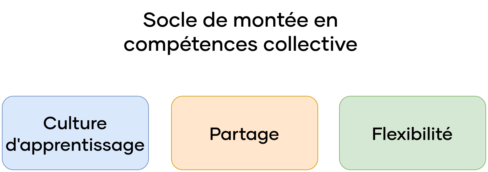
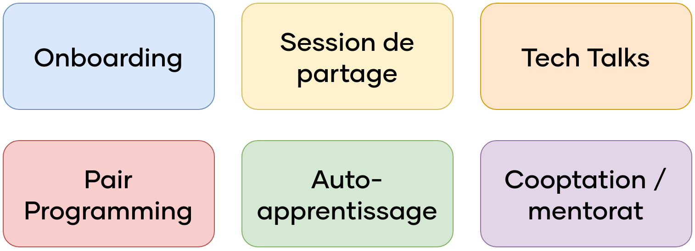


\newpage

#   Démarches d'apprentissage et de montée en compétences

Pour faire face à la charge de travail liée au développement de l'application de vente en ligne demandé par la direction, l'équipe va s'agrandir pour accueillir de nouveaux développeurs, dont des développeurs juniors.  
Pour permettre à l'ensemble des développeurs d'avoir des compétences similaires leur permettant de travailler dans les meilleures conditions possibles, nous souhaitons mettre des mesures qui s'appuient sur le socle suivant :

{width=67%}

Nous souhaitons développer une culture d'apprentissage au sein de l'équipe. Il faut que l'apprentissage et le partage de connaissances soient valorisés. Cela se traduit de plusieurs façons que nous verrons par la suite. De plus, il est important de rester flexible, aussi bien pour les développeurs qui ont tous des courbes d'apprentissage différentes, que pour nous. Les besoins de montée en compétences évolueront au fil du temps, il est important d'adapter nos démarches à ces évolutions.

Concrètement, nous souhaitons que cela se traduise de la façon suivante :

 -  Chaque membre de l'équipe, qu'il soit nouveau ou non, participera à un **onboarding** le plus clair et le plus complet possible. À cette occasion, il sera présenté le projet, l'outillage utilisé, les processus et les réglementations en vigueur. Un rappel des bonnes pratiques peut également être établi, ce qui nous permettra de limiter un peu plus notre dette technique au fil du temps.

 -  À intervalles réguliers, des **sessions de partage** seront organisées. Au début de ce rapport, nous évoquions des séances de partage afin de faciliter le maintien en compétences, qui a le même but, à savoir le transfert de connaissances entre membres de l'équipe. Nous pensons donc organiser un créneau commun pour tous les membres de l'équipe (ancien comme nouveau), ce qui favoriserait la communication et la cohésion des équipes, tout en créant une culture d'apprentissage. Ces réunions pourraient être consacrées à des sujets techniques, des retours d'expérience, ou encore des discussions libres.

 -  Une autre piste, serait l'introduction de **tech talks**. Le format serait un peu similaire à une conférence, où des membres de l'équipe comme des partenaires et experts externes peuvent venir parler d'un sujet qui les concerne, et qui pourrait être utile à l'ensemble de l'équipe. Cela permettrait à certaines personnes d'être au courant des dernières nouveautés techniques, et de découvrir de nouveaux sujets.

 -  Nous souhaitons organiser des sessions de **pair programming**, c'est-à-dire des séances de programmation en binôme, qui est l'occasion d'apprendre les uns des autres et de résoudre des problèmes de façon commune. De façon idéale, nous aimerions associer des profils assez différents.

 -  Nous aimerions favoriser l'**autoapprentissage**, en encourageant les développeurs à apprendre de manière autonome en lisant des livres, des articles ou des blogs, en suivant des formations ou en participant à des communautés en ligne.

 -  Enfin, nous aimerions organiser un programme de **cooptation** et de **mentorat**, c'est-à-dire recruter en externe un candidat qui a été recommandé par une personne en interne, non pas pour son lien de parenté, mais pour ses compétences. La personne l'ayant recommandé deviendrait son mentor pendant quelque temps, et aurait en partie à sa charge la montée en compétence du développeur, contre une rémunération ou des avantages supplémentaires.

{width=67%}

Nous pensons que ces idées permettront un apprentissage collectif assez efficace, sans être trop contraignantes pour les développeurs. Encore une fois, ces idées seront à adapter à chacun et au fil du temps, afin qu'elle reste efficace. Elle sera donc revue régulièrement pour y apporter des nouveautés, ou retirer des idées qui ne fonctionnent pas.