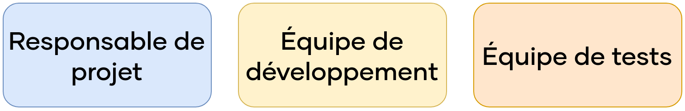


\newpage

#   Assurance qualité

La direction nous a fourni le besoin suivant : créer une application web permettant la vente en ligne pour *Breizhsport*. Pour réaliser celui-ci, nous avons entrepris des étapes qui ont été détaillées plus tôt dans ce rapport. Cependant, il nous est nécessaire de formaliser les exigences attendues en termes de qualité, pour justifier que la solution réponde bien au besoin. Pour cela, on va utiliser un *Plan d'Assurance Qualité* (PAQ), qui est un document commun entre client et fournisseur, afin de s'accorder sur le contexte, le périmètre, les enjeux, et permettant de traduire les attentes et envies du client en besoin fonctionnel. Normalement réalisé et validé en début de projet, il est nécessaire de le refaire valider en cas d'évolution du besoin ou de dérogation qui sort du cadre de ce qui a été défini dans ce document.

Ce *PAQ* reprend divers points de ce rapport. Nous l'avons volontairement allégé afin de ne pas surcharger ce rapport, tout en synthétisant les idées. Pour l'instant nous nous concentrons sur les aspects fonctionnels, les détails techniques des tests seront établis par la suite.

##  Objectifs

Ce *PAQ* a trois objectifs :

 -  **Garantir que l'application réponde aux exigences spécifiées par la direction.**
 -  **Identifier et corriger les défauts et les erreurs avant la mise en production.**
 -  **Améliorer la qualité de l'application au fil du temps.**

Ces objectifs permettent de traduire la demande de la direction de développement d'une application de e-commerce en besoin. Ainsi, avec ce *PAQ*, nous définissons le niveau de qualité attendu afin d'encadrer le développement et la maintenance de l'application dans le temps, pour qu'elle réponde toujours au besoin après l'ajout et la modification de fonctionnalités. Bien évidemment, il sera nécessaire de régulièrement revoir ce PAQ afin de l'adapter à une évolution du besoin.

##  Portée

En plus des objectifs, il est nécessaire de définir les thématiques sur lesquelles le *PAQ* s'applique. À ce stade, nous sommes encore aux premières étapes de développement de l'application. Ainsi, notre PAQ se limite pour l'instant aux éléments suivants :

 -  **Chaîne de déploiement et d'intégration continue**
 -  **Infrastructure**
 -  **Fonctionnalités de sécurité**
 -  **Extensions associées à notre CMS (Wordpress)**
 -  **Organisation des équipes**
 -  **Méthodologie de travail**

\newpage

D'autres aspects à venir, comme la navigation sur le site, le module de paiement et les produits proposés seront rajoutés par la suite, d'où la nécessité de revoir régulièrement ce document. De plus, nous allons aborder la sécurité d'un point de vue assez macro en prenant l'application dans son ensemble. Par la suite, on envisagerait de produire un *Plan d'Assurance Sécurité* (PAS) pour décrire les moyens garantissant la sécurité en détail.

##  Responsabilités

En termes de responsabilités des parties prenantes, nous pouvons le définir comme tel :

{width=67%}

Bien qu'avec une méthode de travail *AGILE*, comme *SCRUM*, la notion de chef de projet n'existe pas, nous définissons un responsable de la coordination des activités que nous appellerons **Service Owner**.  
En plus de cela, nous avons deux équipes distinctes : l'**équipe de développement**, qui développe et intègre les fonctionnalités afin de les faire évoluer ou les maintenir ; l'**équipe de test**, qui développe et effectue les tests visant à garantir la qualité et la sécurité de notre application.

Si l'on souhaitait rentrer plus en détail, on pourrait attribuer un rôle des activités à chaque partie prenante, notamment au travers d'une matrice *RACI*. Cependant, ce document se veut fonctionnel et non technique, ainsi nous en restons-là pour le moment.

##  Méthodologie

Les équipes projet précédemment présentées sont amenées à travailler en mode *AGILE*, au travers de la méthode de travail *SCRUM*. Cette méthode de travail est particulièrement adaptée à des projets de développement informatique, car elle offre une grande flexibilité pour faire face à d'éventuels besoins changeants pour notre application. De plus, les sprints sont cadencés de façon régulière, ce qui nous permet de définir aisément un planning pour vérifier et mettre à jour ce document pour l'adapter à un nouveau besoin.

\newpage

##  Activités d'assurance qualité

Dans le cadre du développement de l'application web permettant la vente en ligne de *Breizhsport*, nous souhaitons mettre en place les activités suivantes afin de garantir la qualité de la solution pour qu'elle répondra au besoin de l'entreprise.

 -  **Vérification des exigences** : nous vérifions les exigences imposées pour l'application, afin de vérifier qu'elles sont complètes, cohérentes, et correctes.
 -  **Vérification de la conception** : nous souhaitons également vérifier que la conception de l'application, ses choix architecturaux et sa stack technique puisse correspondre aux exigences.
 -  **Vérification du code** : pour s'assurer que le code de l'application, ne comporte pas d'erreur, et respecte des standards et conventions de code.
 -  **Tests fonctionnels** : pour vérifier et s'assurer que l'application, fonctionne comme demandé.
 -  **Tests non fonctionnels** : nous souhaitons vérifier que des aspects de performance, de sécurité ou encore de compatibilité fonctionnent comme demandé.
 -  **Tests d'acceptation** : concerne tous les tests effectués dans le cadre de la recette de l'application, qui permet de valider ou non la livraison de la solution à la direction.

Des détails des tests, et de certaines vérifications comme le code, les outils utilisés, sont décrits par la suite dans ce rapport. 

##  Outils et ressources

Pour nous accompagner afin de garantir la qualité de l'application, nous souhaitons mettre en place des outils.  
En particulier, nous souhaitons utiliser **JIRA**, qui est un outil permettant de faire plusieurs choses et favorise la collaboration; il nous permet de gérer notre projet sous une méthodologie *SCRUM*, en nous proposant de quoi des tâches, des modules et des user-stories, et de les intégrer lors d'un sprint. De plus, il nous permet de réaliser un suivi des bugs et des tests de façon assez complète, tout en s'intégrant bien avec notre projet existant.  

Nous avons d'autres outils en lien avec les tests, que nous détaillerons par la suite de ce rapport.

\newpage

##  Planification

Comme évoqué précédemment, pour pouvoir garantir la qualité de l'application dans le temps, il est nécessaire pour nous de revoir ce document régulièrement pour mettre à jour les tests, les exigences, ou encore les ressources associées. Puisque nous sommes encore à la phase de développement de notre application, celui-ci ne sera pas amené à changer avant la livraison de notre premier livrable, sauf si la direction souhaite ré-évaluer son besoin ou ses exigences.  

Cependant, par la suite, nous souhaitons revoir celui-ci de façon à minima trimestrielle, et ce même si le besoin ou les exigences n'ont pas ou peu évolués. Puisque nous sommes sur un format *AGILE* avec des sprints, nous pouvons tout à fait envisager de l'inclure dans notre *sprint backlog* tous les cinq ou dix sprints, en fonction de la durée de nos sprints.  
L'idéal serait de le faire à chaque jalon avec le client, la direction de *Breizhsport* dans notre cas. Par exemple, notre premier jalon étant le *09 février 2024*, nous souhaitons compléter et mettre à jour ce *PAQ* suite à ce jalon, avec validation du client.

##  Suivi et amélioration

Ce document est amené à vivre en parallèle de notre application. Tous les résultats des activités d'assurance qualité sont collectés et analysés, afin que d'éventuelles évolutions ou changements puissent être apportés à ce document.

##  Plan de communication

Enfin, nous souhaitons cadrer la communication de notre application auprès de notre client. Puisque nous avons un client interne, avec des jalons réguliers qui sont imposés, nous estimons ne pas avoir besoin d'effectuer de communication avec la direction en dehors de ces jalons. Une fois l'application livrée et avec des utilisateurs finaux, nous souhaiterons mettre à jour ce document, afin de prendre en compte les éventuelles pannes et opérations de maintenance à communiquer auprès des utilisateurs.

Concernant la communication entre les équipes, nous organisons déjà des sessions de partage de connaissances au sein de l'équipe projet. De plus, **JIRA** que nous souhaitons utiliser permet une communication claire sur des sujets précis entre différents acteurs de nos équipes.

\newpage

##  Dette technique

Un élément à prendre en compte dès à présent est ce que l'on appelle la dette technique : 

 >  La dette technique est l'accumulation d'erreurs et de défauts sur une application, quand la rapidité d'un projet prime sur la qualité et demande ainsi un travail de correction supplémentaire par la suite.

Ainsi, nous souhaitons mettre en place dès à présent une stratégie de gestion de la dette technique, ce qui nous permettra de gagner du temps et par conséquent, réduire les coûts, par la suite.

### Stratégie

Il existe plusieurs stratégies de gestion de la dette techniques. Celles-ci vont dépendre de la taille et la complexité de l'application, des ressources disponibles, des objectifs, etc.  

Soit on adopte une stratégie :

 -  **Proactive** : dès que l'on identifie une erreur qui causerait de la dette technique, on va chercher à la corriger, ce qui peut se faire au détriment des objectifs et peut engendrer des délais, mais assure la qualité de l'application.
 -  **Réactive** : on s'occupe d'identifier et de corriger les erreurs liées à la dette technique uniquement si elles posent problème. Cela favorise les temps de développement, mais peut engendrer des problèmes à long terme qui peuvent être coûteux.

Chaque stratégie a des avantages et des inconvénients, qui vont dépendre du souhait de la direction. Cependant, on peut imaginer adopter une solution hybride.
Dès que possible, on va chercher à identifier et corriger la dette technique, en particulier pour les problèmes les plus importants. En revanche, pour ce qui pourrait poser des problèmes moins graves, on peut les laisser de côté pour le moment et jusqu'à ce qu'ils causent des problèmes.

Pour cette approche, nous proposons en plus quelques mesures à intégrer dans notre stratégie :

 -  **Intégrer la gestion de la dette technique dans nos processus de développement** : on souhaite utiliser des outils permettant de détecter et de corriger la dette technique dès le départ, comme des *linters*, des scanners de code et des outils de gestion des dépendances. Nous allons développer cette partie par la suite.
 -  **Planifier des audits de code réguliers** : à chaque intervalle de **x** sprints, nous mettons en place des actions visant à identifier et corriger les éléments de dette technique susceptibles de créer des problèmes majeurs par la suite.
 -  **Mettre en place un processus de réécriture du code** : bien que ce ne soit pas idéal, il est probable que nous ayons à réécrire complètement certaines parties de notre application. Il nous faut donc mettre dès à présent un processus qui permet de gérer cette étape, tout en garantissant qu'il n'y a pas de régression ni de nouvelle dette technique.
 -  **Former les développeurs aux bonnes pratiques de développement** : que ce soit sur des principes de conception, de programmation et de documentation, cela nous permettrait de réduire dès le départ notre dette technique.

##  Évolution et amélioration

Comme nous l'avons vu auparavant dans ce rapport, nous souhaitons mettre en place des sessions pour permettre aux collaborateurs d'échanger des connaissances. En favorisant la communication et la formation, nous espérons ainsi que l'ensemble des équipes soient formées dès le départ afin de réduire la dette technique, et ainsi favoriser la qualité de notre application.

Ce *PAQ*, nous permet d'établir les démarches visant à la qualité de notre application. Il sera amené à évoluer dans le temps, afin de refléter les besoins et exigences du moment. Lors de ces évolutions, dans une démarche d'amélioration continue, nous intégrerons également des éléments du retour d'expérience qu'il nous aura permis d'avoir pour pouvoir l'adapter un peu plus à notre équipe, notre mode de fonctionnement et nos outils.