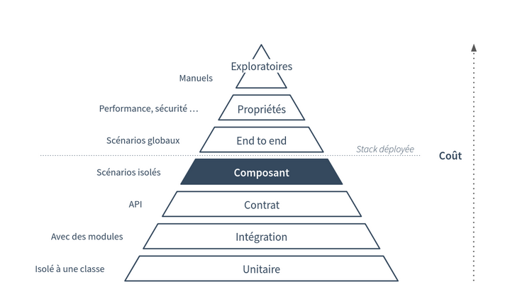

\newpage

#   Politique de tests

Un projet, que ce soit dans le monde matériel ou logiciel, comporte des risques plus ou moins importants et faciles à identifier.
Ces risques sont liés au fait de produire une valeur que l’on voudra éviter de perdre du fait de “régressions” et d'un mauvais fonctionnement lors des différentes évolutions. 
Lors du développement d’un logiciel, plus que dans tout autre domaine, les régressions, bugs, ou effets indésirables sont un impondérable lors de l’ajout de fonctionnalités ou de cas d’utilisation.
Pour compléter le *PAQ* il faut garantir d'une part que la valeur à livrer a été correctement produite et qu'elle sera maintenue sur la durée.
La politique de tests a pour rôle de répondre à la question du “pourquoi teste-t-on ?” et “dans quel but, pour aller dans quelle direction ?”
Cette dernière permettra aux équipes de s'appuyer dessus pour élaborer les plans de tests et concevoir des tests qui minimisent les risques identifiés, tout en adaptant le produit au rythme dicté par le marché ou l'organisation.
Nous décidons de nous appuyer sur la pyramide des tests suivante dans l’ordre indiqué :

 -  Tests unitaires
 -  Tests d’intégration 
 -  Tests de sécurité
 -  Test de non régressions
 -  Tests d’API
 -  Tests End to End
 -  Tests Manuels

 {width=80%}

\newpage
 

En mode *Agile* et *DevOps*, ce sont les développeurs qui rédigent et exécutent les tests, pas les équipes d’assurance qualité. Consulter leur expertise peut permettre aux développeurs de rédiger de meilleurs tests qualité/sécurité. L’équipe qualité peut aussi aider à maintenir un certain cadre de tests, corriger les tests irréguliers.  

Nous nous appuierons sur une **stratégie de test** qui est le **document de haut niveau** définissant, pour un programme, les niveaux de tests à exécuter et les tests dans chacun de ces niveaux (pour un ou plusieurs projets).  
Il s’agit donc d’un document fixant les tests répartis par niveau dans la pyramide des tests, le *RACI* pour chacun des niveaux et les attendus en termes d’objectifs pour chacun des types de tests mis en œuvre.  
C’est à partir de ce document que les équipes de développement du produit vont construire les plans de tests, ou simplement implémenter les tests internes au produit (tests unitaires et d’intégration par exemple). La stratégie de test porte réellement cette répartition des responsabilités.  
Elle identifie pour chaque niveau de tests les éléments suivants :

 -  Le type de test
 -  Les limites de ce que ce niveau teste
 -  Qui implémente les tests du niveau et quand
 -  Le non testé et les risques associés (et assumés) qui est essentiel et sera demandé lors d’un audit ISO 9001 au titre de la maîtrise des risques, notamment si une partie du produit est fournie par un prestataire et doit faire l’objet de contrôles qualité.

La stratégie de test est un document collaboratif entre les différentes équipes et acteurs d’un développement. Elle regroupe les informations sur ce qui sera testé ou non, met en valeur la limite de risque communément acceptée.  
De ce fait, c'est un document construit durant les phases de conception du produit dans sa globalité, de préférence de manière itérative pour faciliter l’émergence d’un compromis et une bonne correspondance avec l’évolution de la connaissance produit.  

Chaque contributeur doit donc durant ces phases de découverte :

 -  Déterminer les niveaux de test qui les incombent.
 -  Déterminer les risques détectables via ces niveaux de tests.
 -  Déterminer si il est nécessaire de faire évoluer la conception pour réduire les facteurs de risque (probabilité, gravité, non-détectabilité) en adaptant la conception pour la rendre plus testable ?
 -  Déterminer le but visé par les tests (Détecter un défaut au plus tôt, valider la bonne implémentation d’un parcours client, détecter une dérive d’une variable de suivi, guider la conception, etc.)
 -  Déterminer les autres acteurs en interface avec les tests dont ils ont la responsabilité et déterminer les informations à échanger avec eux pour faciliter le codéveloppement de la stratégie et plus tard des tests.

Un des éléments importants dans la qualité d’un projet est la connaissance de la responsabilité de chaque acteur dans les étapes des différents processus conduisant à l’ajout de valeur au produit. Le *RACI* permettra l’attribution des pilotes aux différents niveaux de test.
Nous utiliserons le *shift-left* aussi appelé décalage à gauche, il signifie que plus un défaut est détecté plus tôt, plus sa correction est facile à effectuer, et plus le coût de correction deviendra faible.  
Enfin, nous fixerons des règles de sélection des tests en fonction de leur proximité avec le système et leur capacité à être mis en place tôt dans le processus de développement.

##  Tests unitaires

Les tests unitaires doivent être isolés et être exécutables sur n'importe quelle machine, dans n'importe quel ordre, sans affecter les uns les autres. Si possible, les tests ne doivent pas dépendre des facteurs environnementaux ou de l'état global / externe. Les tests qui ont ces dépendances sont plus difficiles à exécuter et généralement instables, ce qui les rend plus difficiles à déboguer et à corriger, et finit par coûter plus de temps qu'ils n'en économisent.
Les tests unitaires doivent aussi être **automatisés** et constitueront la majeure partie de nos tests. Cela peut être quotidien, ou toutes les heures, ou dans le cadre d'un processus d'intégration ou de livraison continue. Les rapports devront être accessibles et examinés par tous les membres de l'équipe. Les équipes devront étudier les métriques comme : la couverture du code, couverture du code modifié, nombre de tests en cours d'exécution, performances, etc.

\newpage

##  Couverture du code

Un outil de couverture de code utilisera un ou plusieurs critères pour déterminer comment notre code a été mis à l'épreuve ou non pendant l'exécution de notre suite de tests.
Dans notre cas, nous utiliserons **SonarQube** comme outil de couverture du code.Les métriques courantes qui seront mentionnées dans nos rapports de couverture sont les suivantes :

 -  **Couverture des fonctions** : nombre de fonctions définies ayant été appelées.
 -  **Couverture des instructions** : combien d'instructions du programme ont été exécutées.
 -  **Couverture des branches** : combien de branches des structures de contrôle (les instructions « If » par exemple) ont été exécutées.
 -  **Couverture des conditions** : combien de sous-expressions booléennes ont été testées pour une valeur vraie et fausse (true/false).
 -  **Couverture des lignes** : combien de lignes du code source ont été testées.

Il ne serait pas raisonnable de fixer un seuil d'échec trop élevé, et une couverture de 90 % est susceptible de faire échouer nos build dans de nombreux cas. Si notre objectif est une couverture de 80 %, nous devrions envisager un seuil d'échec à 70 % comme filet de sécurité pour notre culture CI.
Il faut que notre équipe comprenne comment l’application est censée se comporter lorsqu'une personne l'utilise correctement, mais aussi lorsque quelqu'un essaie de l'endommager. Les outils de couverture de code peuvent nous permettre de comprendre où notre attention doit ensuite se porter, mais ils ne nous diront pas si nos tests existants sont suffisamment robustes pour les comportements inattendus.

##  Couverture fonctionnelle

Notre *Wordpress* fournit des plugins tel que *Woocommerce* permettant de proposer un service de vente sur le site web. Le framework **Timber** permet de modifier le site web de manière simplifié et donc ajoute une réactivité accrue lors de corrections.
Le but est d’anticiper sur les besoins futurs, et donc de choisir un outil évolutif.

\newpage

##  Tests d’intégration

Le fait de mettre en place une chaine d’intégration continue permet de redéployer les composants et dépendances associés au site web ce qui facilite la détection de problèmes de compatibilités suite à une mise à jour ou modification du site web.
*GitLab CI* fait partie de *GitLab*. Il s’agit d’une application web avec une *API* qui stocke son état dans une base de données. 
Le principe consiste à rendre systématique et de façon plus ou moins automatique l'intégration des différents composants d'un système dès que ses composants sont modifiés, pour faire en sorte que les effets produits par ces modifications soient rapidement mesurables. Ceci permet notamment d'éviter les gros bugs difficiles à déceler, et favorise l'agilité dans les projets.
Des tests de dépendances sont inclus dans ces tests avec **OWASP**.

##  Tests de non régression

Enfin, ces tests permettent de valider que la mise en ligne d’une nouvelle fonctionnalité sur un logiciel n’impactera pas les fonctions déjà existantes. Les tests fonctionnels auront bien validé que la nouvelle fonction est opérationnelle mais c’est les tests de non régression qui valideront que cette dernière n’impacte pas les autres fonctionnalités du logiciel.
Les tests de non régression sont déployés sur un environnement de recette et doivent vérifier au minimum que les fonctionnalités principales ou « critiques » du logiciel sont toujours disponibles après la livraison de nouveaux développements.

\newpage

##   Tests de sécurité

Les tests de sécurité des logiciels sont le processus d'évaluation et de test d'un système afin de découvrir les risques et les vulnérabilités de sécurité du système et de ses données. 
Nous utiliserons **Zaproxy** pour effectuer nos tests de sécurité.
Ils sont souvent répartis, de manière quelque peu arbitraire, en fonction du type de vulnérabilité testée ou du type de test effectué. Une répartition courante est la suivante :

 -  **Évaluation de la vulnérabilité** : Le système est scanné et analysé pour détecter les problèmes de sécurité.
 -  **Test de pénétration (pentesting)** : Le système est analysé et attaqué par des attaquants malveillants simulés.
 -  **Test d'exécution** : Le système fait l'objet d'une analyse et d'un test de sécurité de la part d'un utilisateur final.
 -  **Examen du code** : Le code du système fait l'objet d'un examen et d'une analyse détaillés à la recherche de vulnérabilités en matière de sécurité.

Le pentesting suit généralement les étapes suivantes :

 -  **Exploration** : Le testeur tente d'en savoir plus sur le système testé. Il s'agit notamment d'essayer de déterminer quels logiciels sont utilisés, quels points d'extrémité existent, quels sont les correctifs installés, etc. Il s'agit également de rechercher sur le site des contenus cachés, des vulnérabilités connues et d'autres indications de faiblesse.
 -  **Attaque** : Le testeur tente d'exploiter les vulnérabilités connues ou suspectées pour prouver leur existence.
 -  **Rapport** : Le testeur rend compte des résultats de ses tests, y compris les vulnérabilités, la manière dont il les a exploitées, la difficulté des exploits et la gravité de l'exploitation.