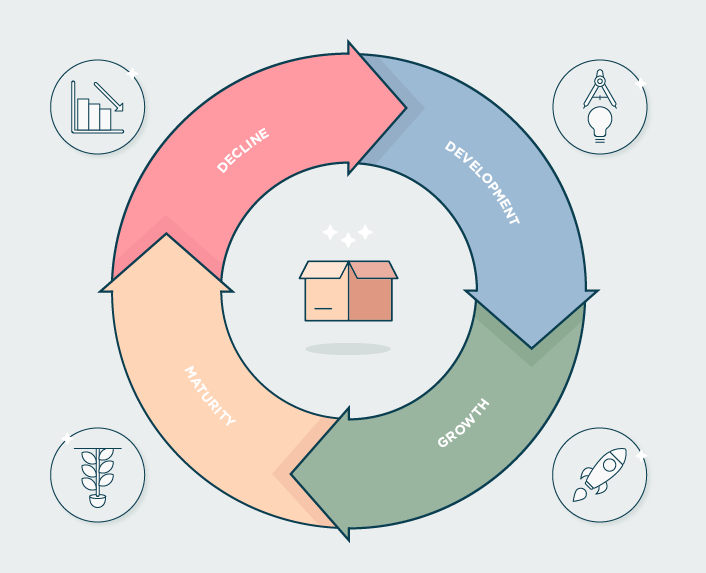
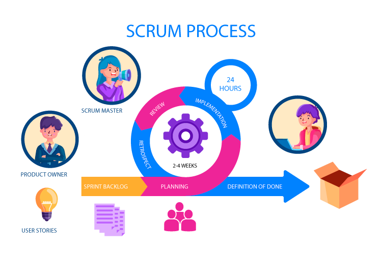


\newpage

#   Amélioration continue

Au cours de ce rapport, nous avons abordé plusieurs aspects concernant la vie de l'application dans le temps. Nous en sommes actuellement à la phase de développement, mais une fois l'application mise en production, celle-ci se doit d'être maintenue régulièrement et d'évoluer pour répondre à une évolution du besoin.

{width=50%}

Ainsi, on souhaite considérer dès à présent cette prochaine étape de maintien en condition opérationnelle, pour à la fois anticiper de la dette technique, mais également parce qu'il est plus simple de définir dès à présent une démarche d'amélioration continue, que de devoir changer notre organisation et les processus de fonctionnement par la suite.

##  Démarche d'amélioration continue

Comme vu précédemment, nous utilisons la méthode *SCRUM* pour organiser notre projet, méthode qui se dit itérative avec des cycles de travail régulier.

{width=50%}

Ainsi, pour organiser notre démarche, le plus simple est de se baser sur ces sprints, où l'on peut imaginer que les **x** sprints, nous mettons en place les activités de notre démarche. Comme nous l'avons vu au cours de ce rapport, c'est ce que nous souhaitons faire pour la qualité du code avec le **Plan d'Assurance Qualité**, et la sécurité de notre application avec notre **Plan d'Audit**. Nous souhaitons également inclure des démarches humaines et managériales, en faisant monter en compétence les équipes.

Pour notre démarche, et pour résumer ce qui a été dit auparavant :

 -  **Revue régulière du *PAQ*** : nous souhaitons que les besoins de qualité soient revus régulièrement afin qu'ils soient toujours adaptés au besoin et au contexte de l'application.
 -  **Revue régulière du *Plan d'Audit*** : à l'instar du *PAQ*, nous souhaitons adapter nos solutions de prévention et de correction face à des risques concernant la sécurité pour qu'ils répondent à une évolution du besoin.
 -  **Stratégie de réduction de la dette technique** : nous optons pour une stratégie hybride concernant la dette technique de notre application. Dès que possible, nous allons chercher à identifier et corriger les problèmes les plus importants qui génèrent de la dette technique. En revanche, pour les risques moins impactant, on peut les laisser de côté pour le moment et jusqu'à ce qu'ils causent des problèmes. À chaque **x** itération de sprint, une liste de ces risques et problèmes est établie, et est intégrée directement dans le *sprint backlog* afin qu'ils soient traités dans le sprint suivant.

\newpage

 -  **Montée en compétence des équipes** : d'un point de vue humain, il est également important de faire évoluer les équipes dans le temps. Les technologies et outils évoluant, il est important que nous ayant une stratégie similaire pour nos équipes. Ainsi, nous avons vu que des actions de montée en compétence, des formations, et surtout des sessions de partage seront mises en place afin de favoriser l'autoapprentissage et le développement des équipes.
 -  **Utilisation d'outils adaptés** : tout comme les équipes et notre application, les outils que nous utilisons seront amenés à évoluer, parfois à disparaître et être remplacé. Il est important que nous ayons des processus de veille technologique bien établis, avec des alternatives disponibles en cas de problème. Pour cela, le **Service Owner** est responsable de s'assurer que les outils sont adaptés aux équipes, et que leur évolution ne risque pas d'impacter notre capacité de maintien en conditions opérationnelles de l'application de vente en ligne.

Avec ces processus, revus régulièrement, tracés et mis à jour au besoin, nous souhaitons assurer non seulement la pérennité de l'application dans le temps, mais également de son maintien par nos équipes pour faire face à toute sorte d'imprévus.

#   Conclusion

Au cours de ce rapport, nous avons abordé plusieurs étapes concernant le développement de l'application web de vente en ligne pour *Breizhsport*. Ces étapes reflètent la volonté de réaliser à la fois une solution qui réponde au besoin énoncé par la direction, mais qui puisse également être pérenne dans le temps au travers de la gestion de sa qualité, sa sécurité, ses technologies et des équipes qui s'en occupent.  
Tout comme certains des documents évoqués, ces démarches seront amenées à évoluer, sans toutefois complètement changer, afin qu'elles soient le plus adaptées possible au besoin et aux envies de la direction, ainsi qu'au contexte dans lequel elle s'inscrit.